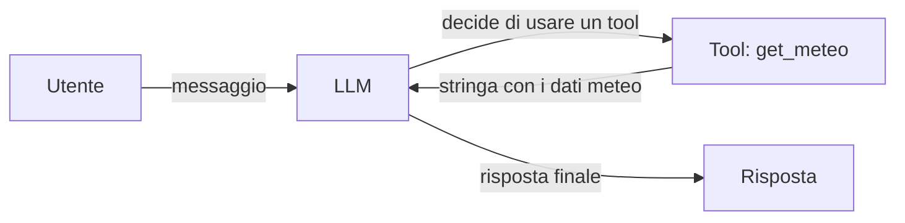

# Introduzione agli agenti AI con LangChain.js e Claude

Costruiamo passo dopo passo un agente AI: partiamo da una semplice chiamata a un
modello e arriviamo a un agente in grado di usare strumenti esterni. Al termine
sarai in grado di leggere e capire tutti i file di questo repo.

Per eseguire gli esempi, crea un file `.env` con `CLAUDE_API_KEY=<tua chiave>` e
lancia `node --env-file=.env examples.js`.

---

## 1. Chiamata diretta a un LLM

Un LLM (Large Language Model) è un modello addestrato su miliardi di testi.
Via codice lo istanziamo come un oggetto e lo chiamiamo con `.invoke()`, passando
un array di messaggi. Restituisce una Promise il cui valore è un oggetto risposta:
il testo generato si trova nella proprietà `.content`.

```js
import { ChatAnthropic } from "@langchain/anthropic";
import { HumanMessage } from "langchain";

const model = new ChatAnthropic({
    model: "claude-haiku-4-5",
    apiKey: process.env.CLAUDE_API_KEY,
});

model.invoke([new HumanMessage("Ciao! Chi sei?")])
    .then(risposta => console.log(risposta.content))
    .catch(err => console.error(err));
```

**Punto chiave:** `model.invoke()` riceve un array di messaggi (`HumanMessage`,
`AIMessage`, ecc.) e restituisce una Promise. Il testo generato è in `risposta.content`.

---

## 2. Limiti del LLM

Il modello conosce solo ciò su cui è stato addestrato: non ha accesso a Internet,
non sa l'ora attuale, non può leggere un database. Se gli chiedi informazioni
in tempo reale, inventa o ammette di non sapere.

```js
model.invoke([new HumanMessage("Che tempo fa a Milano oggi? Dimmi la temperatura esatta.")])
    .then(risposta => console.log(risposta.content))
    .catch(err => console.error(err));
```

Eseguendo questo codice il modello risponderà che non ha accesso a dati in tempo
reale, oppure fornirà una stima generica. Non è un bug: è il comportamento
corretto di un LLM senza strumenti.

**Punto chiave:** un LLM da solo non può rispondere a domande che richiedono
dati esterni. Per farlo, ha bisogno di un **tool**.

---

## 3. Il concetto di tool

Un tool è una normale funzione JavaScript che mettiamo a disposizione del modello.
Il modello legge `name` e `description` per capire quando e come usarla; quando
decide di usarla, il framework la esegue e restituisce il risultato al modello, che
lo integra nella risposta finale.

```js
import { tool } from "langchain";
import { z } from "zod";

const getMeteo = tool(
    (input) => Promise.resolve(`Meteo per ${input.città}: soleggiato, 22°C`),
    {
        name: "get_meteo",
        description: "Restituisce le condizioni meteo attuali per una città.",
        schema: z.object({
            città: z.string().describe("Nome della città"),
        }),
    }
);

// Proviamo il tool chiamandolo direttamente
getMeteo.invoke({ città: "Roma" })
    .then(risultato => console.log(risultato))
    .catch(err => console.error(err));
```

Due vincoli importanti da rispettare:

- **Il tool deve restituire sempre una stringa** (o una Promise che risolve a una
  stringa). Anthropic non accetta altri tipi di ritorno.
- **Lo schema radice deve essere `z.object({})`**. `z.array()` non è supportato
  come schema di primo livello.

**Punto chiave:** un tool è una funzione con metadati (`name`, `description`,
`schema`). Il modello usa quei metadati per decidere autonomamente quando invocarla.

---

## 4. Creazione di un agente con createAgent

Un agente è un LLM a cui abbiamo assegnato dei tool e, facoltativamente, un ruolo
tramite `systemPrompt`. L'agente gestisce in autonomia il ciclo
messaggio → eventuale chiamata tool → risposta finale.

```js
import { createAgent } from "langchain";

const agente = createAgent({
    model,
    systemPrompt: "Sei un assistente meteo. Usa il tool get_meteo per rispondere.",
    tools: [getMeteo],
});

agente.invoke({ messages: [new HumanMessage("Che tempo fa a Roma?")] })
    .then(risposta => console.log(risposta.messages.at(-1).content))
    .catch(err => console.error(err));
```

### Flusso interno di una tool call



1. Il messaggio dell'utente arriva al modello.
2. Il modello riconosce che serve un dato esterno e invoca il tool giusto.
3. Il tool esegue la funzione JavaScript e restituisce una stringa.
4. Il modello riceve la stringa e genera la risposta finale.

L'output dell'agente è un oggetto con una proprietà `messages` (array). L'ultimo
messaggio è sempre la risposta finale del modello: si legge con `.messages.at(-1).content`.

**Punto chiave:** `createAgent` orchestra il ciclo tool-call in autonomia.
Tu fornisci il modello, il prompt di sistema e i tool; l'agente gestisce il resto.

---

Quando sei pronto per i pattern avanzati (Supervisor, Parallel, Reflection),
prosegui con [`patterns.md`](patterns.md).
