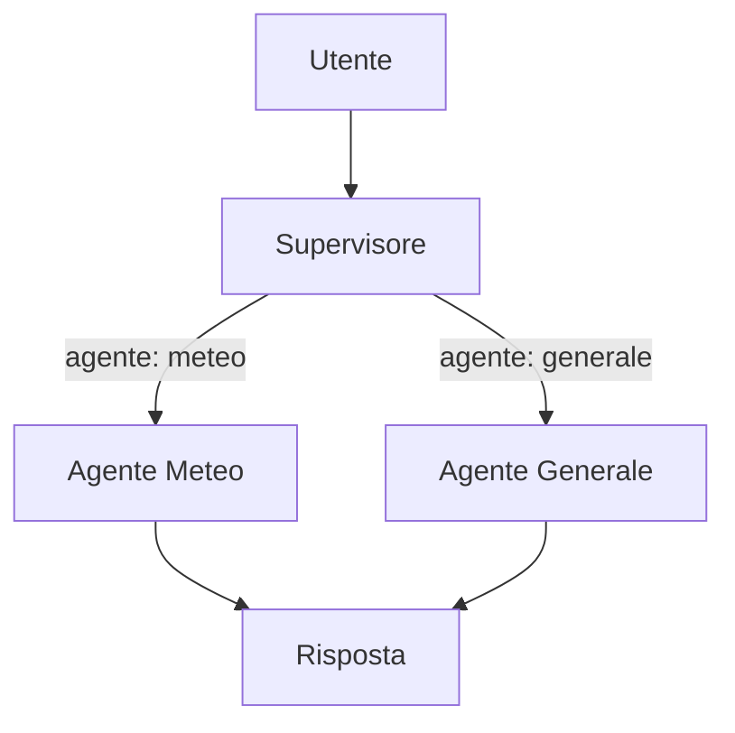
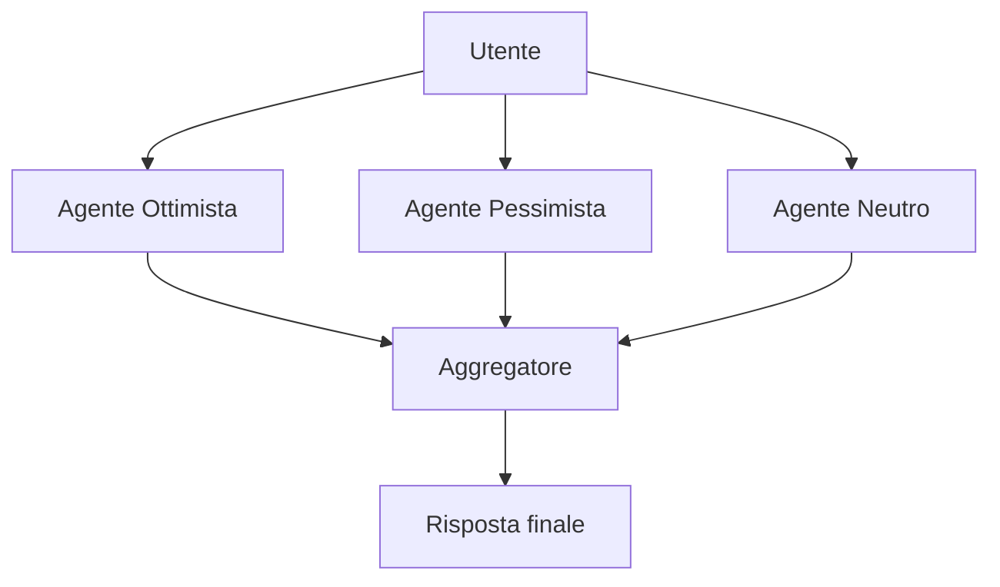
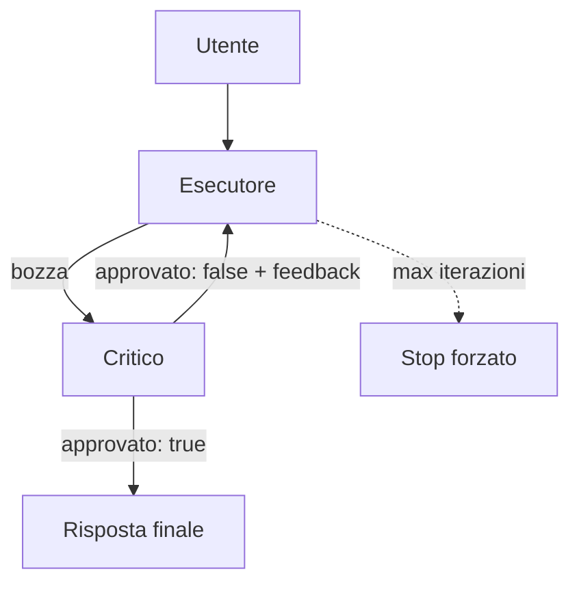

# Pattern multi-agente con LangChain.js e Claude

Durata stimata: 1 ora (~20 minuti per pattern).

Questa lezione assume che tu sappia già cos'è un agente e un tool con LangChain
(vedi il `README.md` nella root). Qui esploriamo come far lavorare più agenti insieme.

Ogni pattern ha il suo script nel `package.json`:

```
pnpm run pattern-supervisor
pnpm run pattern-parallel
pnpm run pattern-reflection
```

Il file `.env` deve contenere `CLAUDE_API_KEY=<tua chiave>` (vedi `.env.example`).

---

## Pattern 1 — Supervisor

**Problema:** hai più agenti specializzati e devi decidere quale usare in base alla
richiesta. La soluzione naive è una serie di `if` o `regex` nel codice: fragile,
non generalizza, richiede aggiornamenti manuali per ogni nuovo caso.

**Soluzione:** un agente Supervisor legge la richiesta e restituisce il nome
dell'agente da usare. `responseFormat` con `z.enum()` vincola la risposta a valori
precisi: il modello non può inventare valori fuori dalla lista.



```js
const supervisore = createAgent({
    model,
    systemPrompt: "Leggi la domanda e decidi se riguarda il meteo oppure è una domanda generica.",
    tools: [],
    responseFormat: z.object({
        agente: z.enum(["meteo", "generale"]).describe("L'agente da usare"),
    }),
});

function chat(domanda) {
    return supervisore.invoke({ messages: [new HumanMessage(domanda)] })
        .then(risposta => {
            const scelta = risposta.structuredResponse.agente;
            const agente = scelta === "meteo" ? agenteMeteo : agenteGenerale;
            console.log(`Supervisor ha scelto: ${scelta}`);
            return agente.invoke({ messages: [new HumanMessage(domanda)] });
        })
        .then(risposta => console.log("Risposta:", risposta.messages.at(-1).content))
        .catch(err => console.error(err));
}

chat("Che tempo fa a Milano?");
chat("Quante ore ha un giorno?");
```

Il Supervisor restituisce un oggetto strutturato tramite `risposta.structuredResponse`.
Il codice JavaScript legge la scelta e chiama l'agente corretto. Il secondo `.then()`
riceve la risposta dell'agente specializzato, non del Supervisor.

**Punto chiave:** il routing è fatto da un LLM, non da regole scritte a mano.
`z.enum()` garantisce che la scelta sia sempre uno dei valori previsti.

---

## Pattern 2 — Parallel

**Problema:** alcune analisi richiedono più prospettive indipendenti. Eseguirle
in sequenza è lento: il tempo totale è la somma di tutti i tempi.

**Soluzione:** più agenti partono contemporaneamente con `Promise.all()`. Quando
tutti hanno finito, un agente aggregatore sintetizza i risultati. Il tempo totale
diventa quello del più lento, non la somma.



```js
const proposta = "Aprire un negozio di abbigliamento online";
const messaggi = [new HumanMessage(`Analizza questa proposta: "${proposta}"`)];

Promise.all([
    agenteOttimista.invoke({ messages: messaggi }),
    agentePessimista.invoke({ messages: messaggi }),
    agenteNeutro.invoke({ messages: messaggi }),
])
.then(([rispostaOttimista, rispostaPessimista, rispostaNeutro]) => {
    const analisi = {
        ottimista: rispostaOttimista.messages.at(-1).content,
        pessimista: rispostaPessimista.messages.at(-1).content,
        neutro: rispostaNeutro.messages.at(-1).content,
    };
    return agenteAggregatore.invoke({
        messages: [new HumanMessage(`
Ottimista: ${analisi.ottimista}

Pessimista: ${analisi.pessimista}

Neutro: ${analisi.neutro}
        `)]
    });
})
.then(risposta => console.log("Giudizio finale:\n", risposta.messages.at(-1).content))
.catch(err => console.error(err));
```

`Promise.all()` riceve un array di Promise e aspetta che tutte completino.
Il `.then()` riceve un array di risultati nello stesso ordine dell'input:
`[rispostaOttimista, rispostaPessimista, rispostaNeutro]` via destructuring.
L'aggregatore non chiama API aggiuntive: lavora solo sui testi già ricevuti.

**Punto chiave:** con `Promise.all()` il tempo totale è quello del più lento, non
la somma. L'aggregatore è un agente normale: cambia solo il contenuto del suo prompt.

---

## Pattern 3 — Reflection

**Problema:** un singolo agente produce output di qualità variabile. Non c'è modo
di sapere se il risultato è buono senza una valutazione esterna.

**Soluzione:** due agenti con ruoli opposti lavorano in loop. L'Esecutore genera
una bozza; il Critico la valuta e restituisce `approvato: true/false` con feedback.
Se non approvata, la bozza aggiornata torna all'Esecutore. Il loop continua fino
all'approvazione o al raggiungimento di `maxIterazioni`.



```js
const maxIterazioni = 3;

// Gestisce un singolo ciclo esecutore→critico e si richiama ricorsivamente se necessario
// bozza: testo dell'ultima versione; feedback: suggerimenti dell'iterazione precedente
function eseguiCiclo(prodotto, iterazione = maxIterazioni, bozza = "", feedback = "") {
    if (iterazione === 0) {
        console.log(`*** Limite di ${maxIterazioni} iterazioni raggiunto.`);
        return Promise.resolve(bozza);
    }

    const prompt = bozza === ""
        ? `Scrivi una descrizione per questo prodotto: "${prodotto}"`
        : `Riscrivi e migliora questa descrizione tenendo conto del feedback ricevuto:\n${bozza}\n\nFeedback: ${feedback}`;

    let nuovaBozza;

    return esecutore.invoke({ messages: [new HumanMessage(prompt)] })
        .then(risposta => {
            nuovaBozza = risposta.messages.at(-1).content;
            const iterazioneCorrente = maxIterazioni - iterazione + 1;
            console.log(`Iterazione ${iterazioneCorrente} — Bozza:\n${nuovaBozza}`);
            return critico.invoke({ messages: [new HumanMessage(`Valuta questa descrizione:\n${nuovaBozza}`)] });
        })
        .then(valutazione => {
            const { approvato, feedback: nuovoFeedback } = valutazione.structuredResponse;
            if (approvato) {
                console.log("Descrizione approvata!");
                return nuovaBozza;
            }
            console.log(`Feedback del critico: ${nuovoFeedback}`);
            // chiamata ricorsiva: passa bozza e feedback come argomenti separati
            return eseguiCiclo(prodotto, iterazione - 1, nuovaBozza, nuovoFeedback);
        });
}

function patternReflection(prodotto) {
    eseguiCiclo(prodotto)
        .then(versioneFinale => console.log(`Versione finale:\n${versioneFinale}`))
        .catch(err => console.error(err));
}
```

La logica è divisa in due funzioni: `eseguiCiclo` gestisce un singolo ciclo e si richiama
ricorsivamente; `patternReflection` è il punto d'ingresso che stampa il risultato finale.
Il contatore `iterazione` parte da `maxIterazioni` e scende a zero (conto alla rovescia):
`iterazioneCorrente` converte il valore in un numero crescente per il log.
`bozza` e `feedback` viaggiano come argomenti separati, così `Promise.resolve(bozza)`
al limite restituisce sempre la bozza pulita, senza il testo del feedback concatenato.
`feedback: nuovoFeedback` rinomina la proprietà in destructuring per evitare conflitti
con il parametro `feedback` della funzione.

**Punto chiave:** il Critico non riscrive, valuta e suggerisce. È l'Esecutore che
migliora a ogni ciclo. `maxIterazioni` è obbligatorio: senza, la ricorsione non avrebbe
mai un caso base e il programma andrebbe in loop infinito.

---

## Confronto tra i tre pattern

| Pattern | Quando usarlo | Numero di chiamate API |
|---|---|---|
| Supervisor | Smistamento su tipi di richiesta diversi | 2 (supervisor + agente scelto) |
| Parallel | Analisi con più prospettive indipendenti | N agenti in parallelo + 1 aggregatore |
| Reflection | Quando la qualità dell'output deve essere validata | 2 per iterazione, fino a `maxIterazioni` |

I pattern sono componibili: un Supervisor può smistare verso un sotto-sistema
Parallel, oppure verso un agente che usa internamente Reflection.
